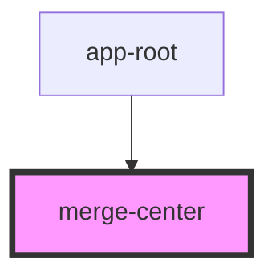

# merge-center

<!-- Auto Generated Below -->

## Properties

| Property               | Attribute           | Description | Type                  | Default     |
| ---------------------- | ------------------- | ----------- | --------------------- | ----------- |
| `activeSessionId`      | `active-session-id` |             | `string \| undefined` | `undefined` |
| `open`                 | `open`              | 弹窗是否打开。     | `boolean`             | `false`     |
| `project` _(required)_ | --                  |             | `CourseProject`       | `undefined` |

## Events

| Event         | Description | Type                                  |
| ------------- | ----------- | ------------------------------------- |
| `applyMerged` |             | `CustomEvent<{ snapshot: unknown; }>` |
| `mergeClosed` |             | `CustomEvent<any>`                    |

## Dependencies

### Used by

 - [app-root](../app-root)

### Graph

----------------------------------------------

*Built with [StencilJS](https://stenciljs.com/)*
